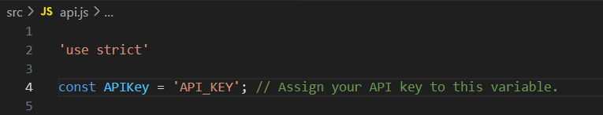
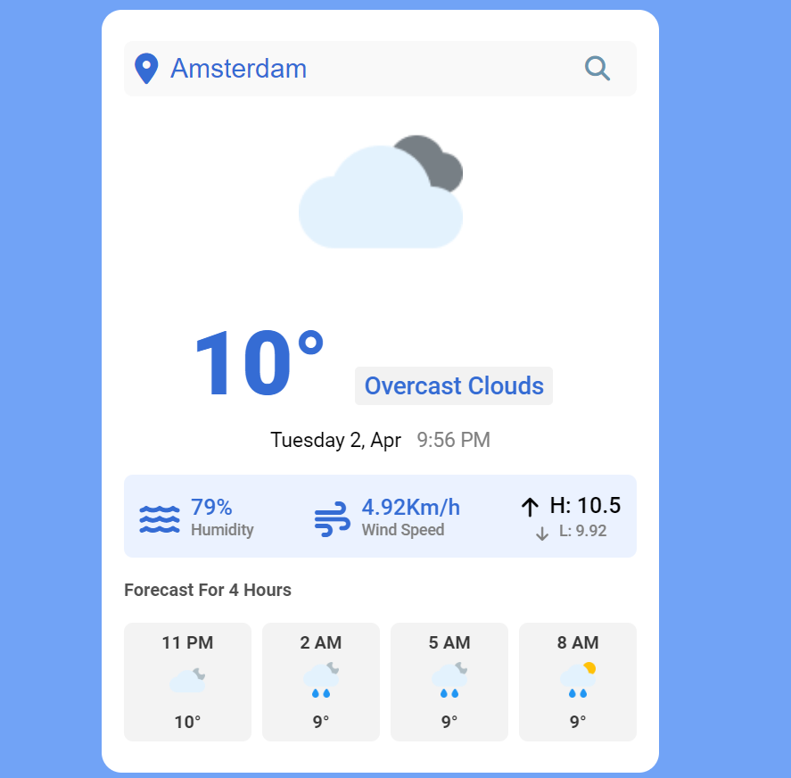
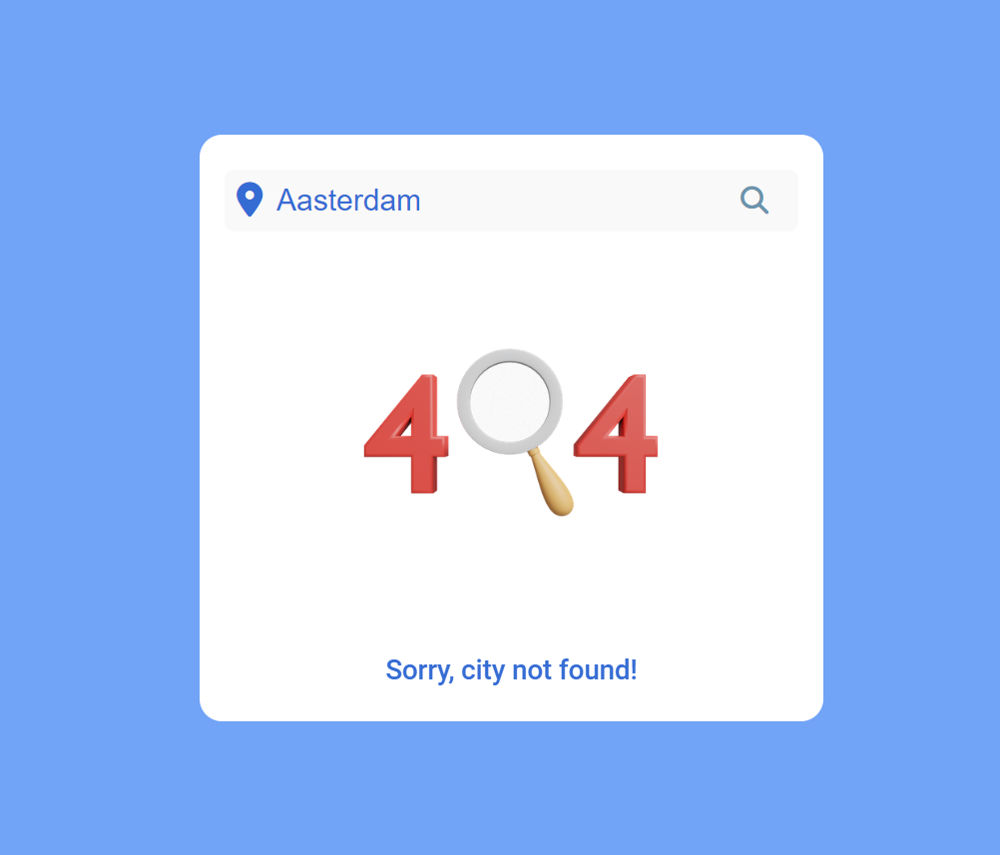

## Project name:
Weather App

## Project description:
The Weather App is a web application that provides users with real-time weather 
information based on their location or a specified location. It leverages weather data 
obtained from a third-party API to deliver accurate and up-to-date weather forecasts,
including temperature, humidity, wind speed, and conditions such as rain or snow.

## Project Functionalities:
    1. Current Weather Display: Display the current weather conditions, including temperature, humidity, wind speed, and weather conditions (e.g., sunny, cloudy, 
    rainy).

    2. Location-Based Weather: Allow users to input a specific location.

    3. Responsive Design: Ensure the app is responsive and accessible across various devices and screen sizes.

    4. Error Handling: Implement robust error handling to gracefully handle cases such as invalid input or failed API requests.
    
    5. API Integration: Integrate with a weather API to retrieve accurate and up-to-date weather data for display in the app.

    6. Forecast Display: Show weather forecasts for the upcoming hours.

### Note
You need to get your own api key and replace it with the one in api.js file on line 4 (see below):

### Screenshot
Here I have a project screenshot:

